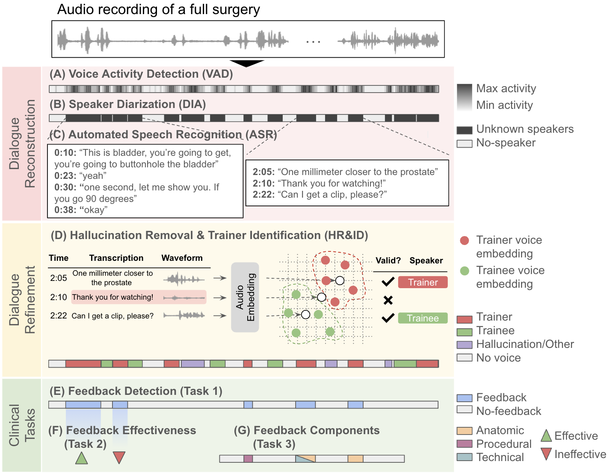

# Automating Feedback Analysis in Surgical Training: Detection, Categorization, and Assessment
---
#### Firdavs Nasriddinov*, Rafal Kocielnik*, Arushi Gupta, Cherine Yang, Elyssa Wong, Anima Anandkumar, Andrew J. Hung

This official repository holds code for the paper "**Automating Feedback Analysis in Surgical Training: Detection, Categorization, and Assessment**". Our [Paper](https://www.arxiv.org/abs/2412.00760) is accepted at [ML4H 2024](link). 


<hr>

## Overview

This work presents a novel framework for automating the analysis of feedback in surgical training, specifically targeting the detection, categorization, and assessment of verbal interactions between trainers and trainees during robot-assisted surgeries. While traditional methods rely on labor-intensive manual annotation, our approach reconstructs structured surgical dialogues from unstructured recordings, addressing key challenges such as background noise and role ambiguity.

The framework consists of three key steps:

1. **Dialogue Reconstruction**: This step integrates foundational techniques such as Voice Activity Detection (VAD) to identify speech timespans, Speaker Diarization (DIA) to separate speech from different speakers, and Automated Speech Recognition (ASR) to transcribe the audio into text.

2. **Dialogue Refinement**: This step addresses limitations in the initial reconstruction by removing hallucinations (spurious transcriptions caused by background noise) and identifying trainer/trainee speaking turns. Few-shot embeddings of known voice samples are used to ensure accurate speaker assignment.

3. **Clinical Task Evaluation**: The refined dialogues are applied to clinically relevant tasks, including feedback detection, assessment of feedback effectiveness, and categorization of feedback components, demonstrating the framework's ability to support downstream tasks effectively.

We also implemented a **Fixed-Window** approach as a baseline. This method classified 10-second overlapping audio windows using multimodal models based on audio and text features. While it offered initial insights into feedback detection, its performance was limited compared to our framework, which integrates more advanced reconstruction and refinement techniques.

Evaluation on a dataset of 33 surgeries highlights the framework’s capability to reconstruct surgical teaching dialogues and detect feedback instances effectively, achieving an F1 score of 0.79±0.07. The hallucination removal step improved feedback detection performance by 14%. Furthermore, the framework achieved F1 scores comparable to manual annotations for downstream clinically relevant tasks, such as predicting behavioral adjustments of trainees (F1: 0.82±0.03) and classifying technical feedback (F1: 0.81±0.03). These results underscore its potential to enhance surgical training and education at scale.

## Results
| **Technique**      | **Data Processing**               | **Classifier**   | **F1-bin**     | **Precision**   | **Recall**      |
|--------------------|-----------------------------------|------------------|----------------|----------------|----------------|
| **Fixed-Window**   | Voice Activity Detection (VAD)    | -                | 0.42±0.20      | 0.28±0.17      | 1.00±0.00      |
|                    | + Audio                           | Wav2Vec2         | 0.52±0.11      | 0.49±0.19      | 0.59±0.11      |
|                    | + Text (ASR)                      | BERT             | 0.59±0.13      | 0.55±0.18      | 0.66±0.10      |
|                    | + Text (ASR)                      | GPT-4o           | 0.60±0.11      | 0.60±0.16      | 0.62±0.06      |
|                    | + Audio + Text (ASR)              | Multimodal       | 0.58±0.13      | 0.53±0.19      | 0.67±0.07      |
| **Dialogue**       | Dialogue†                         | GPT-4o           | 0.58±0.11      | 0.64±0.15      | 0.55±0.09      |
|                    | + Hallucination Rem. (baseline)   | GPT-4o           | 0.59±0.07      | 0.57±0.07      | 0.61±0.08      |
|                    | + Hallucination Rem. (our)        | GPT-4o           | 0.66±0.18*     | 0.65±0.22      | 0.71±0.11      |
|                    | + Trainer/Trainee ID (our)        | GPT-4o           | **0.79±0.07*** | **0.76±0.12**  | **0.85±0.09**  |

† Dialogue is a combination of VAD, DIA, and ASR applied in sequence and grouped with the context of past utterances leading to feedback.  
* Statistically significant gain compared to the prior step in dialogue reconstruction at *p<0.05, †p<0.1.

| **Data Processing**         | **Feedback Effectiveness** |                            | **Feedback Components**                         |                          |                           |
|-----------------------------|----------------------------|----------------------------|-----------------------------------------------|--------------------------|---------------------------|
|                             | **Beh. Adj.**             | **Verb. Ack.**             | **Anatomic**                                  | **Procedural**           | **Technical**             |
| Manual annotations          | 0.78±0.03                | 0.63±0.04                 | 0.64±0.11                                     | 0.46±0.19                | 0.78±0.03                 |
| Dialogue                    | 0.80±0.02                | 0.61±0.09                 | **0.69±0.09**                                 | 0.45±0.18                | 0.77±0.03                 |
| + Hallucination Rem.        | **0.82±0.03†**           | **0.66±0.06***            | 0.65±0.09                                     | **0.49±0.17†**           | **0.81±0.03***            |
| + Trainer/Trainee ID        | **0.82±0.08**            | 0.64±0.04                 | 0.66±0.08                                     | 0.46±0.17                | **0.81±0.03**             |

**Notes:**
- Beh. Adj.: Behavioral Adjustment
- Verb. Ack.: Verbal Acknowledgment
- Statistically significant gain compared to the prior step in dialogue reconstruction: *p<0.05, †p<0.1.


## Key Components

### Models

- **ExtractDialogueModel**: This model is responsible for extracting diaologue from entire surgical recordings and 1) detecting, 2) categorizing, 3) assessing feedback. It uses OpenAI's GPT models to detect and analyze dialogue and categorize feedback into various types such as verbal acknowledgment, behavioral change, anatomic, procedural, and technical feedback.

- **AudioModel**: This model detects feedback from short audio clips using the Wav2Vec2 model.

- **TextModel**: This model detects feedback from transcriptions of short audio clips using the BERT model.

- **AudioTextFusionModel**: This model detects feedback from a multimodal fusion of transcription embeddings (via BERT) and audio embeddings (via Wav2Vec2) of short audio clips.

- **TemporalDetectionModel**: This model detects feedback from entire surgical recordings with the ability to use any of the fine-tuned models from AudioModel, TextModel, and AudioTextFusionModel.

### Notebooks and Scripts

- **analysis-analyze_dialogue_metrics.ipynb**: Analyzes dialogue metrics.
- **analysis-analyze_temporal_metrics.ipynb**: Analyzes temporal metrics.
- **analysis-confusion_matrices.ipynb**: Generates confusion matrices for model evaluation.
- **analysis-test_similarity_thresh.ipynb**: Tests different cosine similarity thresholds for hallucination removal and speaker identification.
- **demo-dialogue_from_clip.ipynb**: Demonstrates dialogue extraction from audio clips.
- **exps-dialogue.py**: Run experiments for dialogue extraction method.
- **exps-temporal_detection_unseen_case.py**: Experiments with temporal detection on unseen cases.
- **exps-temporal_detection_unseen_surgeon.py**: Experiments with temporal detection on unseen surgeons.
- **misc-assign_anchors.ipynb**: Assigns anchors needed to determine hallucinations and identify speakers against.
- **misc-example_classify_dialogue.ipynb**: Example notebook for classifying dialogue.
- **misc-play.ipynb**: Miscellaneous experiments and playbook.

## Setup

### Prerequisites

- Python 3.8+
- OpenAI API key
- Hugging Face token

### Installation

1. Clone the repository:
    ```sh
    git clone https://github.com/firdavsn/SurgicalFeedbackAI.git
    cd SurgicalFeedbackAI
    ```

2. Install the required packages:
    ```sh
    pip install -r requirements.txt
    ```

3. Set up your OpenAI API key and Hugging Face token:
    - Place your OpenAI API key in openai_api_key.txt
    - Place your Hugging Face token in huggingface_token.txt

<!-- ## License

This project is licensed under the MIT License. See the LICENSE file for details.

## Contact

For any questions or inquiries, please contact [firdavs@caltech.edu](mailto:firdavs@caltech.edu). -->

## Citation
```bash
@misc{nasriddinov2024automatingfeedbackanalysissurgical,
      title={Automating Feedback Analysis in Surgical Training: Detection, Categorization, and Assessment}, 
      author={Firdavs Nasriddinov and Rafal Kocielnik and Arushi Gupta and Cherine Yang and Elyssa Wong and Anima Anandkumar and Andrew Hung},
      year={2024},
      eprint={2412.00760},
      archivePrefix={arXiv},
      primaryClass={eess.AS},
      url={https://arxiv.org/abs/2412.00760}, 
}
```
---